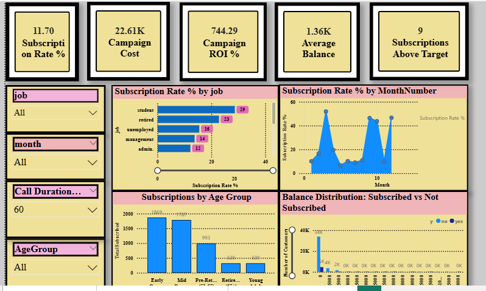
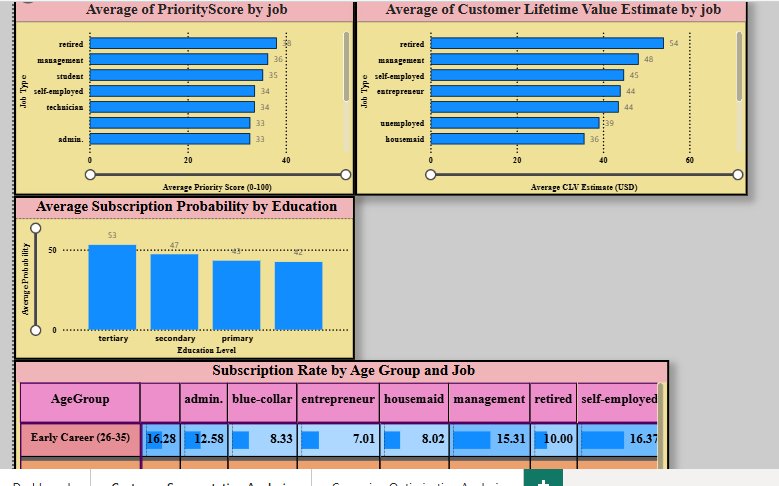
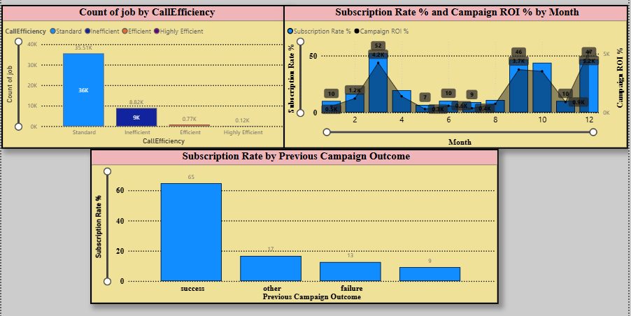

# Bank Term Deposit Subscription Dashboard

## Customer Targeting & Campaign Optimization Analytics (Power BI Project)

---

## Live Dashboard Preview







---

## What Problem Does This Dashboard Solve?

A bank in Portugal runs telemarketing campaigns to sell term deposits. However, the marketing team faces a major challenge:

They do not know:

- Which customers to call first  
- When to call customers  
- How to reduce wasted marketing costs  
- How to improve subscription rates  

This dashboard solves those problems using data analysis and business intelligence.

---

## Key Business Questions Answered

1. Which customers should the marketing team target first?  
2. Which customer groups generate the highest return?  
3. How can the bank reduce campaign cost and improve efficiency?  

---

## About the Data

| Item | Details |
|------|--------|
| Source | UCI Machine Learning Repository |
| File name | bank-full.csv |
| Number of rows | 45,211 customers |
| Number of columns | 17 features |
| Time period | May 2008 – November 2010 |
| Target variable | Whether customer subscribed (yes/no) |

---

## Tools Used

- Power BI Desktop → Dashboard creation  
- Power Query → Data cleaning and transformation  
- DAX (Data Analysis Expressions) → Calculations and KPIs  

---

## Original Dataset Columns

| Column Name | Description |
|-------------|-------------|
| age | Customer age |
| job | Type of job |
| marital | Marital status |
| education | Education level |
| default | Credit default status |
| balance | Average yearly account balance |
| housing | Housing loan status |
| loan | Personal loan status |
| contact | Contact method |
| day | Last contact day |
| month | Last contact month |
| duration | Last call duration (seconds) |
| campaign | Number of contacts in campaign |
| pdays | Days since last contact |
| previous | Previous campaign contacts |
| poutcome | Previous campaign outcome |
| y | Subscription result (target) |

---

## New Features Created (Feature Engineering)

| Column Name | Description |
|-------------|-------------|
| AgeGroup | Customer age categories |
| BalanceTier | Low to Very High balance grouping |
| PreviouslyContacted | Whether customer was contacted before |
| CallEfficiency | Measures call effectiveness |
| SubProbability | Subscription likelihood score (0–100) |
| CLVEstimate | Customer lifetime value estimate |
| PriorityScore | Ranking score for calling priority |
| MonthNumber | Numeric month for sorting |

---

## Data Cleaning Process (Power Query)

- Replaced "unknown" values with null  
- Created AgeGroup for segmentation  
- Created BalanceTier for financial grouping  
- Created PreviouslyContacted flag  
- Removed extreme age outliers (<18 or >95)  
- Removed unrealistic call durations (>5000 seconds)  
- Standardized month ordering using MonthNumber  

---

## Key DAX Measures

```dax
Total Customers =
COUNTROWS('bank-full')

Total Subscribed =
CALCULATE(COUNTROWS('bank-full'), 'bank-full'[y] = "yes")

Subscription Rate % =
DIVIDE([Total Subscribed], [Total Customers]) * 100

Average Balance =
AVERAGE('bank-full'[balance])

Average Call Duration =
AVERAGE('bank-full'[duration])

Campaign Cost =
[Total Customers] * 0.50

Revenue Per Subscriber =
AVERAGEX(
    FILTER('bank-full', 'bank-full'[y] = "yes"),
    'bank-full'[balance]
) * 0.02

Total Revenue =
[Total Subscribed] * [Revenue Per Subscriber]

Campaign ROI % =
DIVIDE([Total Revenue] - [Campaign Cost], [Campaign Cost]) * 100

Call Efficiency Ratio =
DIVIDE(
    CALCULATE([Total Subscribed], 'bank-full'[duration] <= 200),
    CALCULATE([Total Customers], 'bank-full'[duration] <= 200),
    0
) * 100
```

---

## Dashboard Pages Overview

---

### Page 1: Executive Dashboard

- Key KPIs: Subscription rate, ROI, cost, revenue  
- Filters by job, age group, and month  
- Subscription rate by job type  
- Monthly campaign performance trends  
- Age group performance analysis  
- Balance distribution comparison  
- Top customer segment table  

---

### Page 2: Customer Segmentation

- Priority score by job  
- Customer lifetime value by job  
- Subscription probability by education  
- Heatmap of age vs job performance  

---

### Page 3: Campaign Optimization

- Call efficiency by job type  
- Monthly ROI vs subscription rate  
- Impact of previous campaign success  

---

## Key Business Insights

| Finding | Business Action |
|---------|----------------|
| Retired customers have highest subscription rate (28–32%) | Prioritize retired customers |
| May and June perform poorly (~18%) | Reduce campaign activity in these months |
| Previous successful customers are 3x more likely to convert | Retarget past successful customers |
| Higher balance customers convert more | Focus on premium customers |
| Optimal call duration is 200–500 seconds | Train agents for optimal call length |

---

## Files in This Repository

| File | Description |
|------|-------------|
| bank_term_deposit_dashboard.pbix | Power BI dashboard file |
| bank_term_deposit_dashboard.pdf | Exported dashboard report |
| screenshots/ | Dashboard page images |
| power_query/cleaning_steps.txt | Data cleaning steps |
| dax_measures/measures.txt | All DAX calculations |
| data/bank-full.csv | Original dataset |

---

## How to Use This Dashboard

1. Download `bank_term_deposit_dashboard.pbix`  
2. Open using Power BI Desktop (free)  
3. Use filters (job, age, month) to explore insights  
4. Hover on visuals for detailed breakdowns  
5. Switch pages using navigation buttons  

---

## My Certifications

| Certification | Link |
|--------------|------|
| Data Analytics | https://savanna.alxafrica.com/certificates/T95s3SPMxZ |
| Data Science | https://savanna.alxafrica.com/certificates/flJSZ2Xs6r |
| Professional Foundations | https://savanna.alxafrica.com/certificates/RYz9rB28SJ |
| Python Programming | https://savanna.alxafrica.com/certificates/Ee8x6JfGCh |
| Machine Learning | https://savanna.alxafrica.com/certificates/7zsMrEN5m2 |

---

## About Me

**George Onyango Ochieng**

I am a data analyst focused on turning raw data into business decisions.

### Skills:
- Power BI Dashboard Development  
- Data Cleaning with Power Query  
- DAX Calculations  
- Python for Data Analysis  
- Machine Learning Basics  

### Interests:
- Fintech analytics  
- Customer behavior analysis  
- Fraud detection systems  
- Business intelligence dashboards  

I am currently seeking freelance and remote data analytics opportunities.

---

## Contact Information

- Phone: +254 115 136 359  
- WhatsApp: https://wa.me/254111866769  
- Email: georgebabji1220@gmail.com  
- GitHub: https://github.com/George-tech-svg/Data-analyis-bank-term-deposit-dashboard  
- LinkedIn: https://www.linkedin.com/in/george-onyango-5a5906360/  

---

## Final Note

This project demonstrates:

- Real-world business problem solving  
- Data cleaning and transformation  
- Dashboard design and storytelling  
- Customer segmentation analysis  
- Marketing optimization using data  

**Goal:** Help businesses make smarter, data-driven marketing decisions.

---
